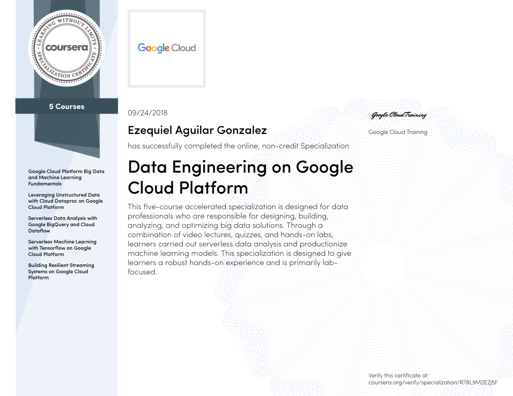

# Data Engineering on Google Cloud Platform Specialization

## Courses
1. - [x] [Google Cloud Platform Big Data and Machine Learning Fundamentals](https://github.com/skielosky/google-data-engineering-on-google-cloud-platform/tree/master/01-google-cloud-platform-big-data-and-machine-learning-fundamentals)
2. - [x] [Leveraging Unstructured Data with Cloud Dataproc on Google Cloud Platform](https://github.com/skielosky/google-data-engineering-on-google-cloud-platform/tree/master/02-leveraging-unstructured-data-with-cloud-dataproc-on-google-cloud-platform)
3. - [x] [Serverless Data Analysis with Google BigQuery and Cloud Dataflow](https://github.com/skielosky/google-data-engineering-on-google-cloud-platform/tree/master/03-serverless-data-analysis-with-google-bigQuery-and-cloud-dataflow)
4. - [x] [Serverless Machine Learning with Tensorflow on Google Cloud Platform](https://github.com/skielosky/google-data-engineering-on-google-cloud-platform/tree/master/04-serverless-machine-learning-with-tensorflow-on-google-cloud-platform)
5. - [x] [Building Resilient Streaming Systems on Google Cloud Platform](https://github.com/skielosky/google-data-engineering-on-google-cloud-platform/tree/master/05-building-resilient-streaming-systems-on-google-cloud-platform)

|Certification name|Data Engineering on Google Cloud Platform Specialization|
| --- | --- |
|Certification authority|Coursera - Google Cloud|
|License number| R78L9M2E2J5F|
|Time period - From|September 2018|
|Time period - To| - |
|Certification URL|[https://www.coursera.org/account/accomplishments/specialization/R78L9M2E2J5F](    https://www.coursera.org/account/accomplishments/specialization/R78L9M2E2J5F) |
